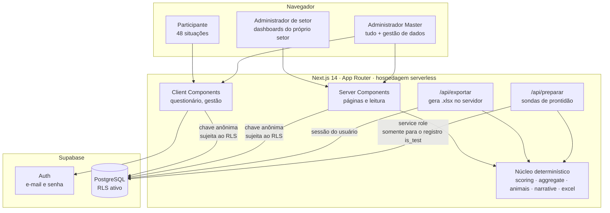
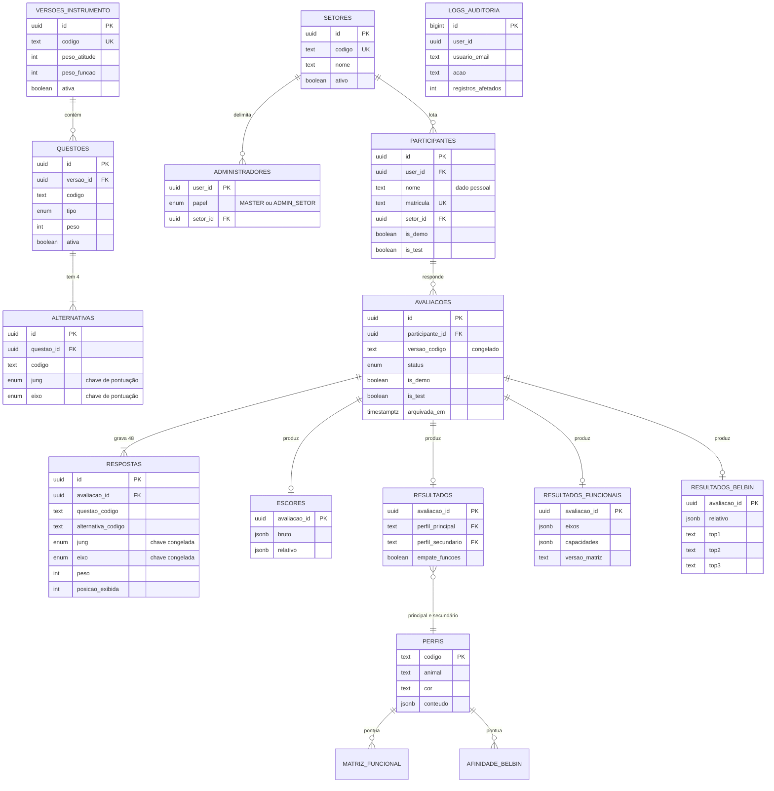
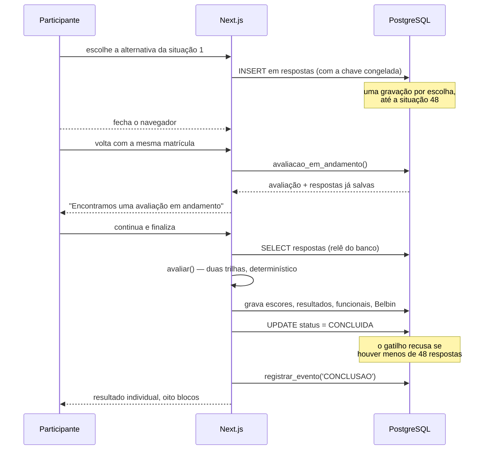
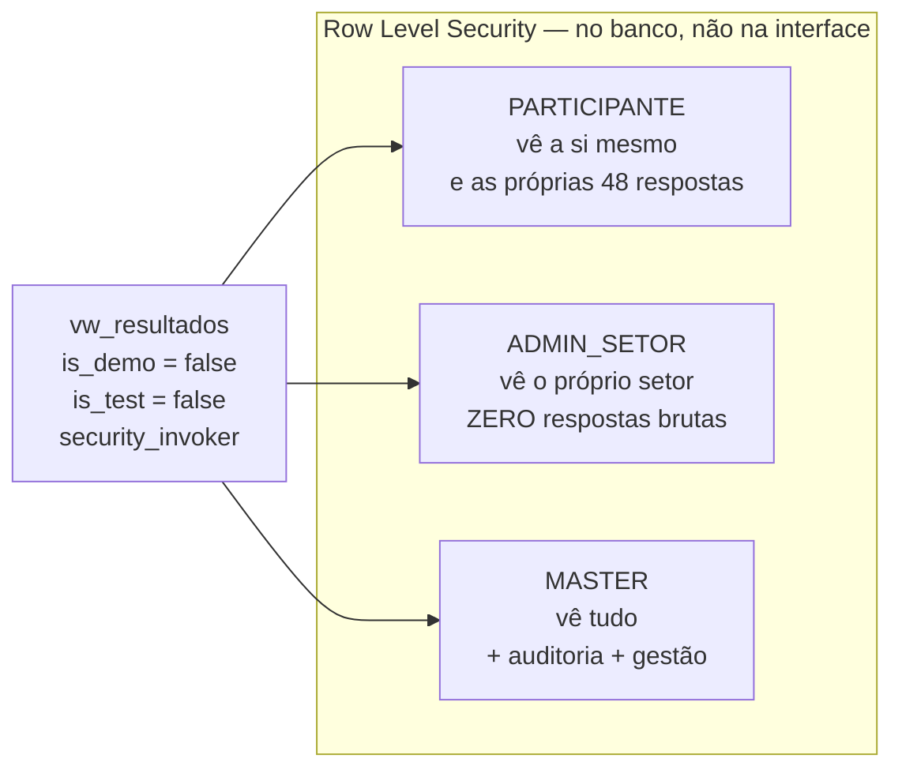

# Diagrama do banco — ROTA26

Item 86 e item 87. Diagrama da solução **como ela é**, não de tecnologia
planejada. Renderizável em qualquer visualizador com suporte a Mermaid
(GitHub, VS Code, Obsidian).

---

## 1. Arquitetura da solução

**O que não existe** e não deve ser procurado: não há backend próprio, fila,
cache distribuído, worker, microsserviço nem serviço de IA em tempo de execução.
O cálculo é uma biblioteca TypeScript pura, executada no processo do Next.js.

---

## 2. Modelo entidade-relacionamento

---

## 3. Fluxo do dado, do clique ao indicador

---

## 4. Onde o sigilo é aplicado

Verificado com três identidades reais em PostgreSQL: participante vê 1 pessoa e
48 respostas próprias; administrador de setor vê seu setor e **0** respostas
brutas, e é recusado ao tentar limpar dados; Master vê tudo.
